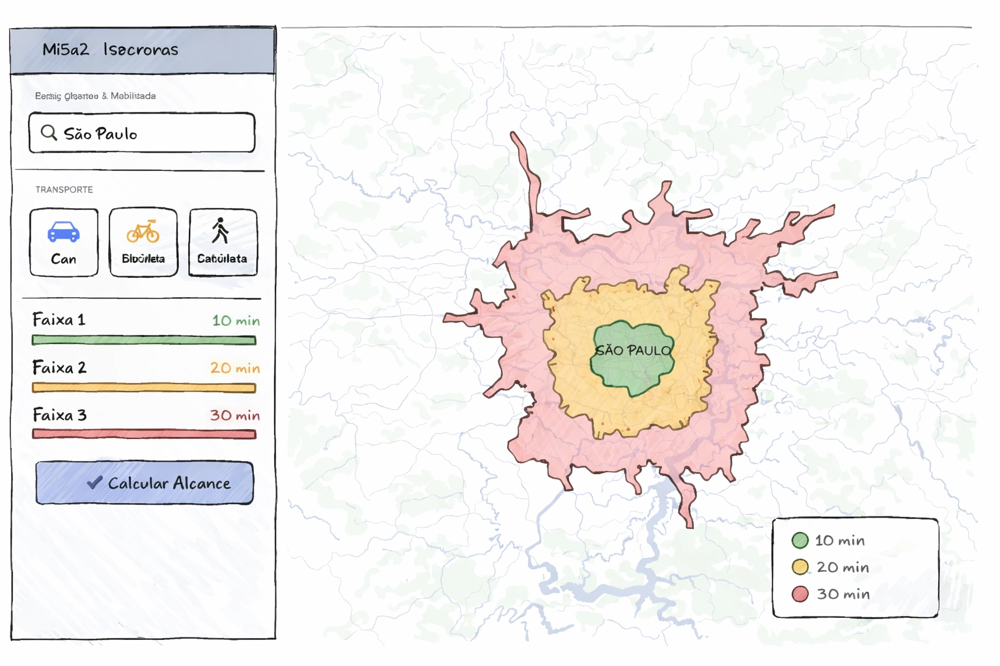

# 🗺️ Calculadora de Isócronas

Ferramenta de inteligência imobiliária e mobilidade urbana que calcula **isócronas** (áreas de alcance por tempo) e cruza com dados censitários do IBGE.

<p align="center">
  
</p>


📡 **https://iso.imob.dev** — Oracle Ampere (ARM64) | Cloudflare SSL | Deploy automático via GitHub Actions

---

## ✨ Funcionalidades

- **Isócronas por tempo** — Visualize o que é acessível em X minutos de carro, bicicleta ou a pé
- **Setores censitários IBGE** — Cruza isócronas com dados do Censo 2022 (população, domicílios, bairros)
- **Filtro de 50% de área** — Inclui apenas setores com no mínimo 50% da área dentro da isócrona
- **Camadas de malha IBGE** — Toggles para subdistritos e bairros IBGE com threshold de 50% de cobertura
- **Badges por setor** — Exibe NM_DIST, NM_SUBDIST, BAIRRO, NU, AGLOM, RGINT e RGI em modo exploração
- **Pontos de Interesse** — Farmácias, escolas, hospitais, parques, mercados via Overpass API
- **Análise com IA** — Relatório imobiliário automatizado via Google Gemini (opcional)
- **Download CSV** — Exporta lista de setores censitários com dados populacionais
- **Highlight interativo** — Clique em setores no mapa ou na lista para destacá-los
- **UI modernizada** — Design glassmorphism com bottom sheet responsivo

## 🏗️ Estrutura do Projeto

```
isocronas/
├── src/                          # Frontend React + Vite
│   ├── App.jsx                   # Componente principal
│   ├── App.css                   # Estilos globais
│   ├── main.jsx                  # Entry point
│   ├── components/               # Componentes React
│   │   ├── Icon.jsx              # Ícones SVG
│   │   ├── HelpModal.jsx         # Modal de ajuda
│   │   ├── CensusPanel.jsx       # Painel de setores censitários
│   │   └── MapLegend.jsx         # Legenda do mapa
│   └── services/                 # Serviços / API calls
│       ├── api.js                # Configuração e constantes
│       ├── geocodeService.js     # Nominatim + IBGE
│       ├── isochroneService.js   # OpenRouteService API
│       ├── censusService.js      # Backend de setores
│       ├── malhaConfig.js        # Config centralizada das camadas IBGE
│       ├── poiService.js         # Overpass API (POIs)
│       └── csvExport.js          # Exportação CSV
│
├── backend/                      # Backend Python
│   ├── server.py                 # FastAPI + endpoints
│   ├── gpkg_utils.py             # Parser GeoPackage / SQLite
│   └── models.py                 # Modelos Pydantic
│
├── malha/                        # Dados IBGE (não versionado)
│   └── BR_setores_CD2022.gpkg    # GeoPackage (~1.5 GB)
│
├── .env.example                  # Exemplo de variáveis de ambiente
├── index.html                    # Entry HTML (Vite)
├── vite.config.js                # Config Vite + proxy
├── package.json
└── requirements.txt              # Dependências Python
```

## 🚀 Instalação

### Pré-requisitos

- **Node.js** ≥ 18
- **Python** ≥ 3.10
- **GeoPackage IBGE** — Baixe a [malha de setores censitários do Censo 2022](https://www.ibge.gov.br/geociencias/organizacao-do-territorio/malhas-territoriais.html) e coloque em `malha/BR_setores_CD2022.gpkg`

### Setup

```bash
# 1. Clone o repositório
git clone https://github.com/seu-usuario/isocronas.git
cd isocronas

# 2. Instale dependências do frontend
npm install

# 3. Instale dependências do backend
pip install -r requirements.txt

# 4. Configure as chaves de API
cp .env.example .env
# Edite o arquivo .env com suas chaves (veja seção abaixo)
```

## 🔑 Configuração de API Keys

As chaves de API são configuradas via variáveis de ambiente no arquivo `.env` na raiz do projeto. **Nunca commite o arquivo `.env` no Git** (já está no `.gitignore`).

Copie o arquivo de exemplo e edite com suas chaves:

```bash
cp .env.example .env
```

```env
# Obrigatória — para calcular isócronas
VITE_ORS_API_KEY=sua_chave_aqui

# Opcional — para análise imobiliária com IA
VITE_GEMINI_API_KEY=sua_chave_aqui
```

### Como obter as chaves

| Chave | Como obter | Obrigatória |
|-------|-----------|-------------|
| `VITE_ORS_API_KEY` | Crie uma conta em [openrouteservice.org](https://openrouteservice.org/dev/#/signup) e gere um token gratuito | ✅ Sim |
| `VITE_GEMINI_API_KEY` | Acesse [Google AI Studio](https://aistudio.google.com/apikey) e gere uma API key | ❌ Opcional |

> **Nota:** Sem a chave do Gemini, a funcionalidade "Análise Imobiliária com IA" ficará desabilitada. Todas as outras funcionalidades funcionam normalmente.

### Execução

```bash
# Terminal 1 — Backend (porta 8000)
cd backend && python3 server.py

# Terminal 2 — Frontend (porta 5173)
npm run dev
```

Acesse **http://localhost:5173** no navegador.

## 🐳 Docker

O projeto inclui suporte completo a Docker para desenvolvimento local e deploy em produção.

### Build e execução local com Docker

```bash
# 1. Crie o arquivo .env com suas chaves
cp .env.example .env

# 2. Build e start (frontend + backend em um só container)
docker compose build
docker compose up

# Acesse http://localhost (via Nginx) ou http://localhost:8000 (direto)
```

> **Nota:** O arquivo `malha/BR_setores_CD2022.gpkg` precisa existir localmente — ele é montado como volume read-only no container.

### Arquivos Docker

| Arquivo | Função |
|---------|--------|
| `Dockerfile` | Multi-stage: Node builda o frontend, Python serve API + dist/ |
| `docker-compose.yml` | Orquestra os serviços `app` e `nginx` |
| `nginx/nginx.conf` | Reverse proxy com SSL, gzip e headers de segurança |
| `.dockerignore` | Exclui `node_modules/`, `malha/` e `.env` do contexto de build |

---

## 🚀 Deploy em Produção

**URL:** https://iso.imob.dev — Oracle Ampere (ARM64) com Cloudflare SSL

O deploy é **automático**: qualquer `git push` para a branch `main` aciona o workflow em `.github/workflows/deploy.yml`, que conecta via SSH na instância e executa o build + restart dos containers.

Consulte o guia completo de configuração inicial da instância em **[docs/server-setup.md](docs/server-setup.md)**.

### Segredos do GitHub (necessário configurar uma vez)

Acesse: **seu repositório GitHub → Settings → Secrets and variables → Actions**

| Secret | Valor |
|--------|-------|
| `SSH_HOST` | IP público da instância Oracle |
| `SSH_USER` | usuário SSH da instância (`ubuntu` ou `opc`) |
| `SSH_PRIVATE_KEY` | chave privada SSH para acesso à instância |

## 🔧 APIs Utilizadas

| API | Uso | Autenticação |
|-----|-----|-------------|
| [OpenRouteService](https://openrouteservice.org/) | Cálculo de isócronas | `VITE_ORS_API_KEY` (gratuita) |
| [Nominatim](https://nominatim.openstreetmap.org/) | Geocodificação de endereços | Livre |
| [Overpass API](https://overpass-api.de/) | Pontos de interesse (POIs) | Livre |
| [IBGE API](https://servicodados.ibge.gov.br/) | Código de municípios | Livre |
| [Google Gemini](https://ai.google.dev/) | Análise imobiliária com IA | `VITE_GEMINI_API_KEY` (opcional) |

## 📊 Dados IBGE

O sistema utiliza o GeoPackage `BR_setores_CD2022.gpkg` (~1.5 GB) que contém:

| Campo | Descrição |
|-------|-----------|
| `CD_SETOR` | Código do setor censitário |
| `v0001` | Total de pessoas |
| `v0002` | Total de domicílios |
| `v0003` | Domicílios particulares |
| `v0004` | Domicílios coletivos |
| `v0005` | Média de moradores por domicílio |
| `AREA_KM2` | Área em km² |
| `NM_BAIRRO` | Nome do bairro |
| `NM_DIST` | Nome do distrito |
| `NM_SUBDIST` | Nome do subdistrito (fallback: NM_DIST) |
| `NU` | Núcleo urbano |
| `AGLOM` | Aglomerado |
| `RGINT` | Região geográfica intermediária |
| `RGI` | Região geográfica imediata |
| `SITUACAO` | Situação (Urbano/Rural) |

> **Nota:** O arquivo GeoPackage não é versionado no Git (~1.5 GB). Adicione à pasta `malha/` após clonar.

## 📝 Licença

MIT
